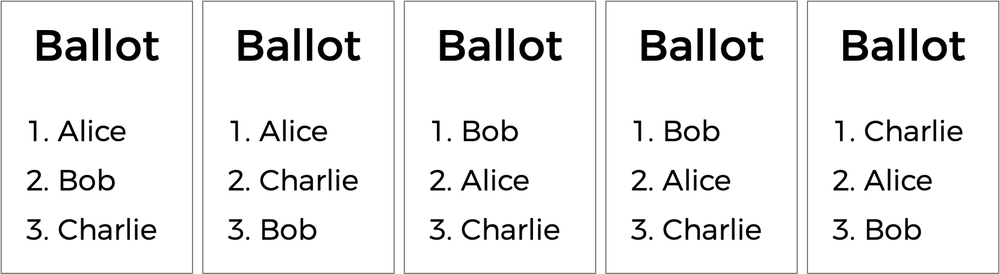
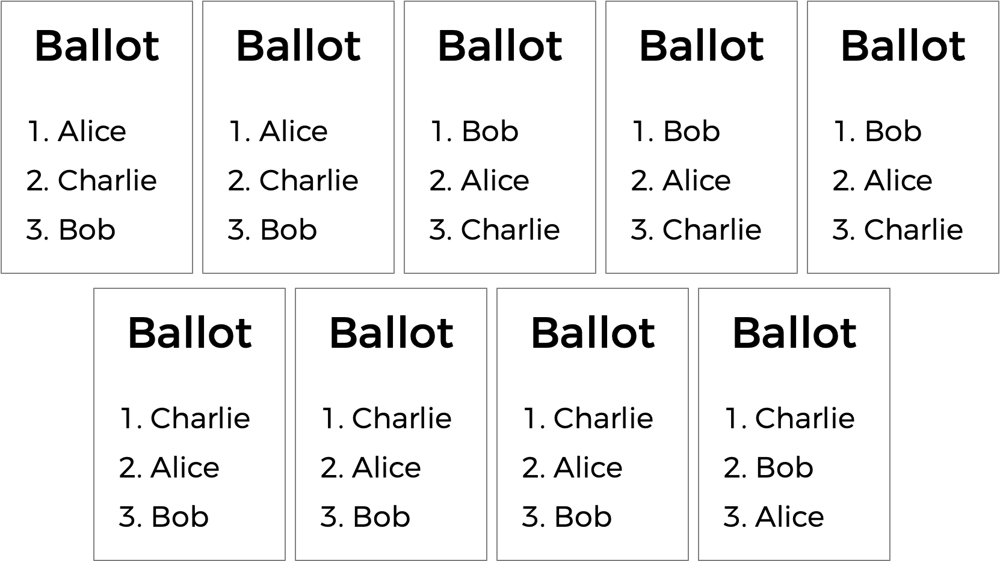
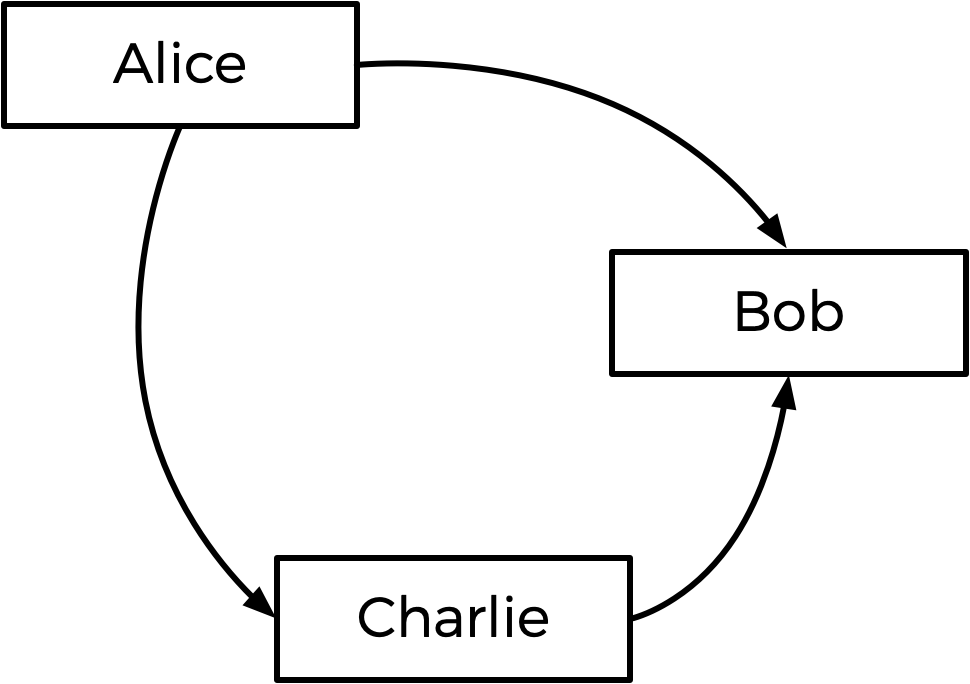
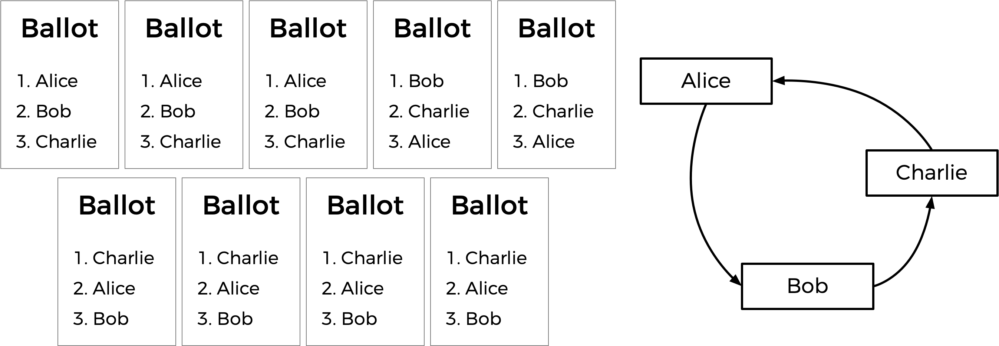
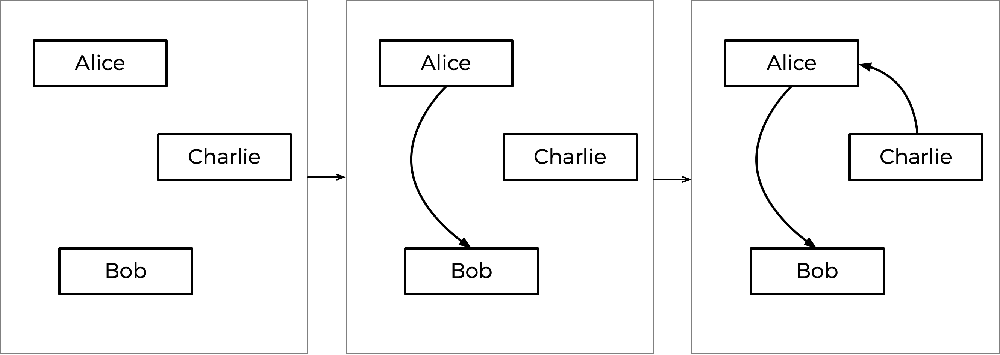

# Tideman
## 需要解决的问题
有一种投票系统，称为排名选择投票系统。在排名选择系统中，选民可以投票给多名候选人。他们不仅可以投票选出他们的最佳选择，还可以按偏好顺序对候选人进行排名。因此，最终的选票可能如下所示。

在这里，每个选民除了指定他们的第一首选候选人外，还指定了他们的第二和第三选择。而现在，之前势均力敌的选举现在可能会产生胜利者。这场比赛最初是在Alice和Bob之间打平。但选择Charile的选民更喜欢Alice而不是Bob，所以Alice在这里可以被宣布为获胜者。

排名选择投票还可以解决多数投票的另一个潜在缺点。看看下面的选票。

谁应该赢得这次选举？在多数投票中，每个选民只选择他们的第一选择，Charlie以四票赢得了这次选举，而Bob只有三票，爱丽丝只有两票。 （请注意，如果您熟悉即时决选投票系统，Charlie也在该系统下获胜）。然而，Alice可能会合理地提出她应该成为选举的获胜者而不是查理：毕竟，在九个选民中，大多数（其中五个）更喜欢Alice而不是Charlie，所以大多数人会对Alice更满意作为胜利者而不是Charlie。

Tideman 投票方法（也称为“排名对”）是一种排名选择投票方法，如果存在的话，可以保证产生孔多塞选举获胜者。在名为`tideman`的文件夹中名为`tideman.c `的文件中，创建一个程序来模拟通过 Tideman 投票方法进行的选举。

## 背景
一般来说，Tideman方法的工作原理是构建候选者的“图”，其中从候选者A到候选者B的箭头（即边）表示候选者A在正面对决中战胜候选者B。那么，上述选举的图表如下所示。

从Alice到Bob的箭头意味着更多的选民更喜欢Alice而不是Bob（5 人更喜欢Alice，4 人更喜欢Bob）。同样，其他箭头意味着更多的选民更喜欢Alice而不是Charlie，更多的选民更喜欢Charlie而不是Bob。

看看这个图，Tideman 方法说选举的获胜者应该是图的“源”（即没有箭头指向他们的候选人）。在这种情况下，来源是Alice——Alice是唯一一个没有箭头指向她的人，这意味着没有人比Alice更受欢迎。因此，Alice被宣布为选举的获胜者。

然而，当箭头拉出时，孔多塞赢家可能并不存在。考虑下面的选票。

在 Alice 和 Bob 之间，Alice 以 7-2 的优势优于 Bob。在Bob和Charlie之间，Bob以 5-4 的优势优于Charlie。但在Charlie和Alice之间，Charlie以 6-3 的优势领先于Alice。如果我们把图表画出来，就没有来源了！我们有一个候选人循环，其中Alice击败了Bob，Bob击败了Charlie，Charlie又击败了Alice（很像石头剪刀布的游戏）。在这种情况下，似乎没有办法选出胜利者。

为了解决这个问题，Tideman 算法必须小心避免在候选图中创建循环。它是如何做到这一点的？该算法首先锁定最强的边缘，因为这些边缘可以说是最重要的。特别是，Tideman 算法规定，根据胜利的“强度”，匹配边缘应每次“锁定”到图表中（越多的人更喜欢某个候选人而不是对手，胜利就越强大） 。只要边可以被锁定到图中而不创建环，则添加边；否则，边缘将被忽略。

在上述投票的情况下，这将如何运作？好吧，一对的最大胜利优势是Alice击败Bob，因为 7 个选民更喜欢Alice而不是Bob（没有其他面对面的比赛有超过 7 个选民选择的获胜者）。因此，Alice-Bob 箭头首先被锁定到图中。下一个最大的胜利是Charlie以 6-3 战胜Alice，因此箭头被锁定在下一个。

接下来是Bob 5-4 战胜Charlie。但请注意：如果我们现在添加一个从Bob到Charlie的箭头，我们将创建一个循环！由于该图不允许循环，因此我们应该跳过这条边，并且根本不将其添加到图中。如果还有更多箭头需要考虑，我们会查看接下来的箭头，但那是最后一个箭头，因此图表是完整的。

该分步过程如下所示，最终图表如右图所示。

根据生成的图表，Charlie是源（没有箭头指向Charlie），因此Charlie被宣布为本次选举的获胜者。

更正式地说，Tideman 投票方法由三个部分组成：
    1.**计票**：一旦所有选民都表明了他们的所有偏好，就确定每对候选人中首选的候选人以及他们的首选程度。
    2.**排序**：按照胜利强度的降序对候选人对进行排序，其中胜利强度定义为更喜欢首选候选人的选民数量。
    3.**锁定**：从最强的对开始，按顺序遍历候选对，并将每对“锁定”到候选图中，只要锁定该对不会在图中创建循环即可。

一旦图表完成，图表的源（没有边指向它的源）就是赢家！

## 理解
让我们看一下`tideman.c` 。

首先，注意二维数组`preferences`。整数`preferences[i][j]`将表示更喜欢候选人`i`而不是候选人`j`的选民数量。

该文件还定义了另一个二维数组，称为`locked`，它将表示候选图。 `locked`是一个布尔数组，因此`locked[i][j]`为`true`表示存在从候选`i`指向候选`j`的边；`false`表示没有边缘。 （如果好奇的话，这种图的表示形式被称为“邻接矩阵”）。

接下来是一个名为`pair`的`struct `，用于表示一对候选者：每对包括`winner`的候选索引和`loser`的候选索引。

候选者本身存储在数组`candidates`中，该数组是表示每个候选者姓名的`string`数组。还有一个`pairs`数组，它将代表选举中的所有候选人对（其中一个比另一个更受青睐）。

该程序还有两个全局变量：`pair_count`和`candidate_count`，分别表示数组`pairs`和`candidates`中的对数和候选数。

现在进入`main` 。请注意，确定候选数量后，程序循环遍历`locked`图，并最初将所有值设置为`false` ，这意味着我们的初始图将没有边。

接下来，程序循环所有选民，并将他们的偏好收集到一个名为`ranks`数组中（通过调用`vote`），其中`ranks[i]`是选民第`i`个偏好的候选人的索引。这些排名被传递到`record_preference`函数中，该函数的工作是获取这些排名并更新全局`preferences`变量。

一旦所有投票都完成，候选对将通过调用`add_pairs`添加到对`pairs`中，通过调用`sort_pairs`进行排序，并通过调用`lock_pairs`锁定到图中。最后，调用`print_winner`打印出选举获胜者的名字！

在文件的更下方，您将看到函数`vote`、`record_preference`、`add_pairs`、`sort_pairs`、`lock_pairs`和`print_winner`留空。

## 规格
以模拟`Tideman`选举的方式完成`tideman.c`的实现。

完成`vote`功能。

该函数接受参数`rank`、`name和ranks`。如果`name`与有效候选人的姓名匹配，那么您应该更新`ranks`数组以指示选民将该候选人作为他们的`rank`偏好（其中`0`是第一偏好， `1`是第二偏好，等等）

回想一下，这里的`ranks[i]`代表用户的第i个偏好。

如果成功记录排名，该函数应返回`true`，否则返回`false`（例如，如果`name`不是候选人之一的姓名）。

您可能会假设没有两个候选人具有相同的名字。

完成`record_preferences`函数。

该函数为每个选民调用一次，并以`ranks`数组作为参数（回想一下， `ranks[i]`是选民的`i` i个偏好，其中ranks[0]是第一个偏好）。

该函数应该更新全局`preferences`数组以添加当前选民的偏好。回想一下，` preferences[i][j]`应该代表更喜欢候选人`i`而不是候选人`j`的选民数量。

您可以假设每个选民都会对每个候选人进行排名。

完成add_pairs函数。

该函数应添加所有候选对，其中一个候选优于对`pairs` 。一对并列的候选人（其中一个不优于另一个）不应添加到数组中。

该函数应将全局变量`pair_count`更新为候选对的数量。 （因此，这些对应该全部存储在`pairs[0]`和`pairs[pair_count - 1]`之间）。

完成`sort_pairs`函数。

该函数应按胜利强度的降序对对`pairs`进行排序，其中胜利强度定义为更喜欢首选候选人的选民数量。如果多对具有相同的胜利强度，您可能会认为顺序并不重要。

完成`lock_pairs`函数。

该函数应该创建`locked`图，按照胜利强度的降序添加所有边，只要边不会创建循环。

完成`print_winner`函数。

该函数应打印出作为图表来源的候选人的姓名。您可能会假设不会有多个来源。

除了`vote`、`record_preferences`、`add_pairs`、`sort_pairs`、`lock_pairs`和`print_winner`函数的实现（以及包含其他头文件，如果您愿意）之外，您不应修改`tideman.c`中的任何其他内容。只要不更改任何现有函数的声明，您就可以向`tideman.c`添加其他函数。

## 如何测试

具有任意数量候选人的选举（ MAX 9名）

按姓名投票给候选人

不在选票上的候选人的选票无效

打印选举获胜者
